# Detecting and Classifying Toxicity in Online Conversation Using Deep Neural Networks

**Author:** Prasoon Karmacharya   
**Email:** [prasoon.karma@gmail.com](prasoon.karma@gmail.com)  
**LinkedIn:** [in\karmacharya](www.linkedin.com/in/karmacharya)

## Background

Online social networks have grown at unprecedented levels. Online social media platforms, like Facebook, Youtube, Reddit, Twitter, and alike have enabled users to establish online communities at an unimaginable scale. With the rise of such social media platforms, online communication has become integral to people’s experience of the internet. We receive an avalanche of text information from the explosion of such online communities. This is more true now than ever, given the worldwide pandemic that has forced all communication to go virtual. However, behind the shield of computers as virtual walls, some individuals also think they can abuse and harass other people.
It is very easy for online communities to devolve into a toxic and abusive environment mostly contributed by the anonymity and pseudo-anonymity of the user. Many platforms rely on Section 230 of the Communications Decency Act of 1996 as their legal backbone to be brazen to content posted by users. Online platforms often struggle to effectively moderate conversations due to the immense volume of content they receive This forces some communities to abandon comment features on their platform. This consequently discourages civil and productive discourse.
Despite concerted efforts by tech giants to reduce abhorrent behavior on their platforms, toxic behavior is very much pervasive. According to [PEW research](https://www.pewresearch.org/internet/2017/07/11/online-harassment-2017/) and [Anti-Defamation League (ADL)](https://www.adl.org/onlineharassment):

* about 40% of people online have faced harassment
* 73% of internet users have seen others get harrassed
* 26% of women between the age of 18 to 24 have received an obscene text
* 27% of online participants do not post anything online because they have seen someone being harassed

These statistics provide a glimpse at the scale and adverse effects of the toxic online environment. To revive the benefits that the internet bestows and minimize its dark-side, anti-toxic platforms and anti-bullying efforts are imperative, especially in a world that seems more polarized and toxic than ever.
Engineering online infrastructure with effective models and capturing the nuance of human opinion through text is a very complex challenge. The common approach employed to solve this problem includes humans facilitating discussions and online fora. This is not only unsatisfactory or ineffective but also very labor-intensive. It often requires a large number of community moderators to manually review every comment. Such a human moderation system is very hard to scale and has a high economic cost.

## Problem Statement

> Can we leverage natural language processing (NLP) and machine learning (ML) to construct a model that can accurately classify the toxicity level in online conversations? In this project, the author aims to engineer a toxicity classifier with high recall and precision using Deep Neural Network Architecture.

## Data

The data utilized in this project was collected from the Civil Comments corpus compiled by Alphabet's Jigsaw and Conversation AI team in partnership with Wikimedia Foundation. The original data set consists of 159571 instances of Wikipedia comments. These text comments are the features for model training and each of these comment text has been given a binary label to identify if the text falls under one of these categories: `Toxic`, `Severe Toxic`, `Obscene`, `Threat`, `Insult` and `Identity Hate`.

**Data dictionary**

| Column Name   | Type    | Description                                           |
| ------------- | ------- | ----------------------------------------------------- |
| text comment  | string  | Feature column, user comment text                     |
| toxic         | boolean | 1 = positive case of toxic, 0 = negative case         |
| severe_toxic  | boolean | 1 = positive case of severe toxic, 0 = negative case  |
| obscene       | boolean | 1 = positive case of obscene, 0 = negative case       |
| threat        | boolean | 1 = positive case of threat, 0 = negative case        |
| insult        | boolean | 1 = positive case of insult, 0 = negative case        |
| identity_hate | boolean | 1 = positive case of identity hate, 0 = negative case |

To test the performance of the models and validate hyperparameters tuning performance, data was segregated into 80% development set, 10% Validation set, and 10% Test set.

One of the challenges faced with this dataset was there was extreme class-imbalances as depicted in figure 1. Additionally, it was found that there was natural interdependence between class labels as shown in the correlation plot in figure 2.

|                           Figure 1                           |                           Figure 2                           |      |
| :----------------------------------------------------------: | :----------------------------------------------------------: | ---- |
| 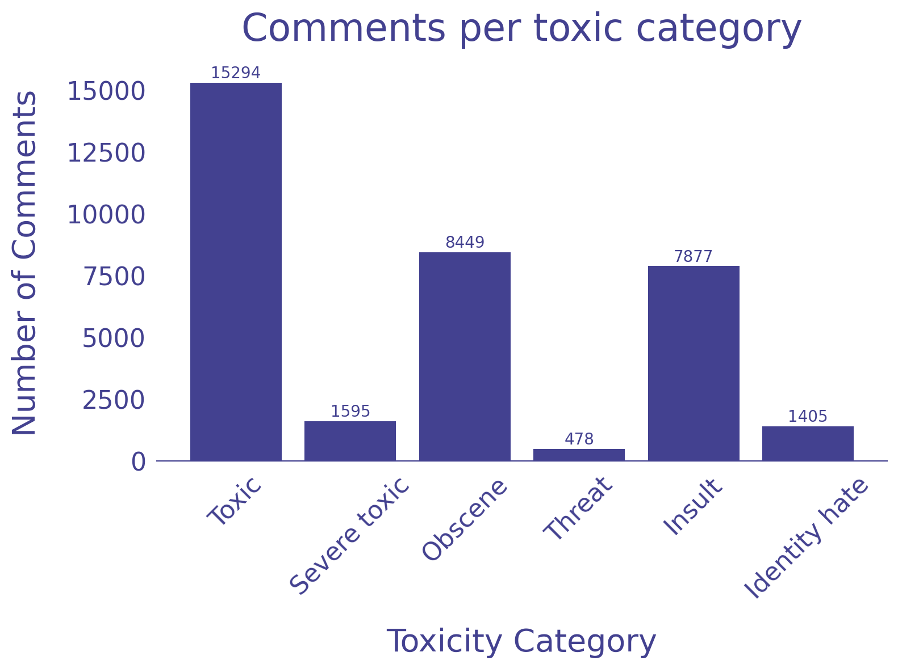 | 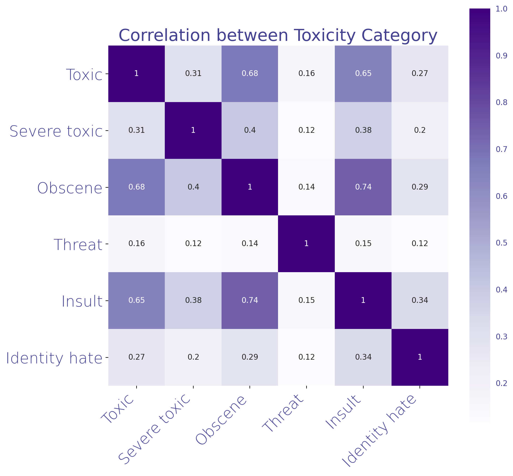 |      |

## Class-imbalance problem

Various data augmentation techniques were employed to minimize the effects of imbalanced classes in the dataset. Augmentation included language translation, synonym replacement, random insertion, random swaps and random deletion. The distribution of data after oversampling the minority class through data augmentation is shown in figure 3. This minimized the imbalanced class problem but did not eliminate it.
 
Alternatively, [SMOTE](https://arxiv.org/pdf/1106.1813.pdf) and class weighting are also available. Due to interdependence between classes it was challenging to incorporate these techniques successfully.

|     Figure 3: Post Augmentation Toxic class distribution     |      |
| :----------------------------------------------------------: | ---- |
| 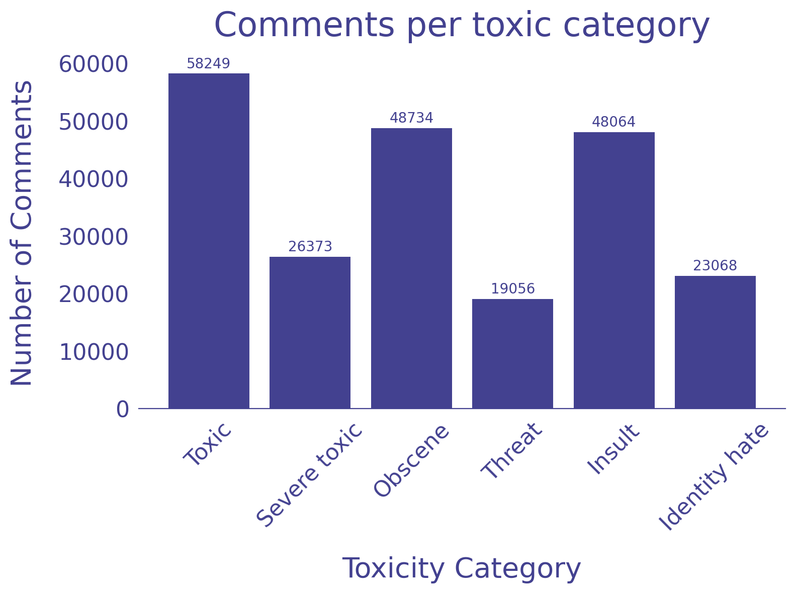 |   |

## Model Selection

### Classical Models

Classical machine learning algorithms like Logistic Regression, Multinomial Naive Bayes, Stochastic Gradient Descent, and Support Vector Classifier were used as a benchmark and preliminary models in this project. Although classical models did perform well on binary classification, it severely struggled to classify multi-label classes. This can be attributed to limitation of classical models to learn the interdependence of labels from a very imbalanced class. In order to circumvent this problem various advanced deep neural network architectures were applied to the task of multi-label toxicity classification.

|       Figure 4: Classical Model Benchmark Performance        |      |
| :----------------------------------------------------------: | ---- |
| 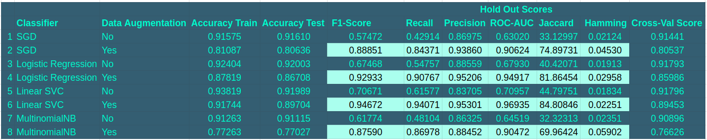 |      |

### Deep Neural Network 

There are many deep neural network architectures that have been successfully employed in NLP tasks like text classification, sentiment analysis, question, and answer settings. In this work, we explored two such deep neural architectures and their variants. Namely, we explored Convolutional Neural Network (CNN) and Recurrent Neural Networks like Bi-directional Long Short Term Memory (Bi-LSTM) with and without attention for both binary classification and multi-label classification.

### Embeddings

While many deep neural network models have shown success in a short text understanding, it relies on human-designed features. Commonly used features for text understanding includes "Bag-of-Words" and parts-of-speech tagging [Post and Bergsma, 2013](https://www.semanticscholar.org/paper/Explicit-and-Implicit-Syntactic-Features-for-Text-Post-Bergsma/552df0475950af93cde5cbeecb0b21b372c23b3c).   However, this approach has one major drawback of data sparsity. The recent success of Deep Learning techniques is largely due to the contribution of [Pennington et. al. 2014](https://nlp.stanford.edu/projects/glove/) that help resolve the problem of sparsity through a novel use of embeddings, Embedding technique helps to capture meaningful syntactic and semantic information that maps semantically similar words in the pre-trained Natural Language Model's vectors space that may not be present in the training dataset. Specifically, this project utilized two of the popular embedding models namely, GloVe [Pennington et al, 2014](https://nlp.stanford.edu/projects/glove/) and FastText [Bojanowski et al.](https://github.com/facebookresearch/fastText)  These embeddings essentially can be thought of as dynamic feature extractors that encode semantic features of words into representative vectors in a lower-dimensional vector space thus removing the need for manual feature engineering of languages semantics. Please refer to the source code for the implementation of these embeddings.

### Model Architectures

#### CNN Model  

While Convolutional Neural Network (CNN) Models have been very successful in computer vision tasks, it has been shown that CNN models can also be effectively utilized in many NLP tasks. Specifically, CNN has demonstrated excellent results in semantic parsing [Yih et al., 2014](https://arxiv.org/pdf/1603.00957), sentence modeling [Kalchbrenner et al.](https://www.aclweb.org/anthology/P14-1062/), and search query retrieval [Shen et at., 2014](https://www.microsoft.com/en-us/research/publication/learning-semantic-representations-using-convolutional-neural-networks-for-web-search/). Like any other neural network architectures, explaining the functional working of CNN is still an active area of research. The lack of interpretability of such models makes it a black-box model. However, it is still useful to have an architecture of the model in mind to make it seem less magical. Figure 4 is the diagram of CNN architecture employed in this project.

|                Figure 4 Binary CNN                |               Figure 5 Multi-label CNN               |      |
| :-----------------------------------------------: | :--------------------------------------------------: | ---- |
| 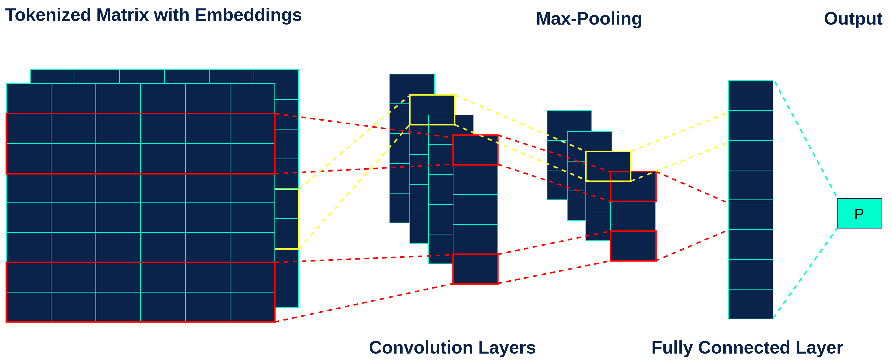 | 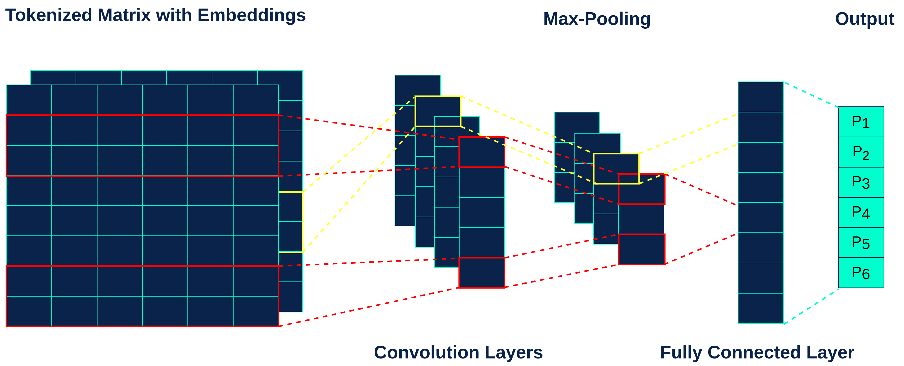 |      |

Here the input text is tokenized and passed through the embedding layer to form a two-dimensional matrix. If the text is too short it is padded to match the length of prescribed maximum length and conversely, the text input is truncated if it is too long.

Then a series of convolution layers is used to extract high-level features from the input matrix. For each layer, we use a nonlinear function called Rectified Linear Unit (ReLU) to capture non-linear relationships within the vector space generated from the input text. The dynamic pooling layer is utilized to abstract the features generated from the convolution layer by aggregating the scores of each filter with the intention to determine the most important features that capture various semantic meanings and sentence morphologies. The pooled features are then learned by the model using a non-linear hidden layer which is then passed through a sigmoid function to obtain a probability value to indicate representative class(es) of the input text. In the case of binary classification, you have one node in the final layer but in the case of multi-label classification as in the case of toxicity class classification, you have multiple nodes as depicted in figures 4 and 5 respectively.

#### Bi-LSTM with attention

Bidirectional Long Short Term Memory (Bi-LSTM) is a type of recurrent neural network that has shown great success for the NLP task. Recurrent Neural Networks, first introduced by [Rumelhart et al.](https://www.nature.com/articles/323533a0) in 1988, got its reputation from its success in time-series modeling and learning various kinds of sequential data. Natural language also shares such sequential characteristics mostly dictated by syntactic and semantic rules of natural written and spoken languages. As such, natural language can be thought of as sequential or short-term time-series data in disguise. With this framework in mind, it felt natural to use RNN models like LSTM, BiLSTM, and Gated Neural Network (GRU). In this work, BiLSTM is specifically explored. Two layers in BiLSTM, forward LSTM, and backward LSTM are used with the intention to allow the model to learn how much to remember and when to forget various semantic and syntactic features in a text input. In addition, such bi-directional LSTM layers act as "gates" analogous to those in GRU models which help to solve vanishing gradient problems commonly seen in many neural network algorithms. The output of the BiLSTM layer is then passed through the attention layer. Not all the words in a sentence contribute equally to the representation of the sentence. The attention mechanism in this architecture helps to extract words that are important to the meaning of the sentence. Figure 7 and Figure 8 shows an architecture of such BiLSTM with an attention model for binary and multilabel classifiers respectively.

|            Figure 6 Binary BiLSTM with Attention             |          Figure 7 Multi-label BiLSTM with Attention          |      |
| :----------------------------------------------------------: | :----------------------------------------------------------: | ---- |
| 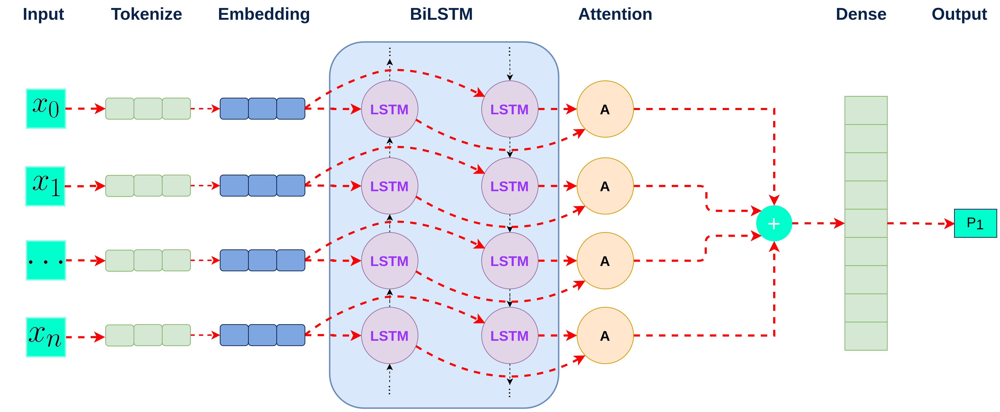 | 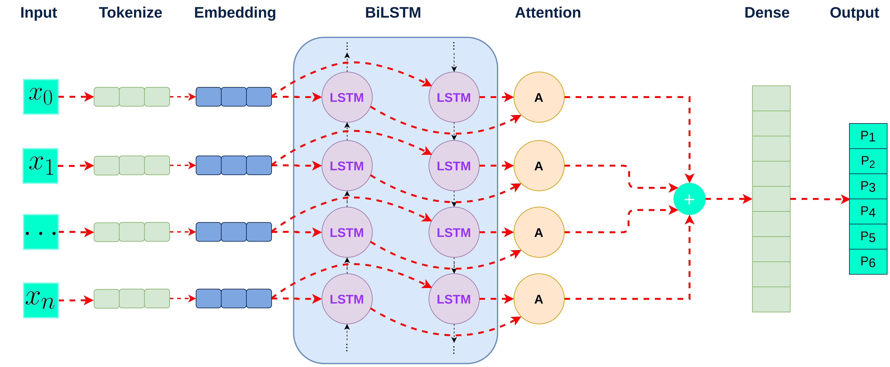 |      |

As shown in the BiLSTM architecture, each input is tokenized and passed through the embedding layer before it is introduced to the BiLSTM layers as depicted in the model architecture. The output of the BiLSTM layer is then passed through the attention layer. The dropout mechanism is utilized in several steps such that the model does not overfit to the training data. Outputs of the Dense layer formed after the attention layer are then passed through a sigmoid function to obtain one output value of probability for binary classification and 6 probability values for multi-label classification.

## Model Evaluation

In general, accuracy is a choice of metric to evaluate classification models. However, the model evaluation metric used in this case was different for two reasons. First, due to class-imbalance in the dataset using accuracy score alone is not sufficient. In fact accuracy can be misleading because the F-1 score for instance may be lower despite obtaining a high accuracy score, effectively leading to poor performance in recall and precision. Second, since the classes in multi-label problems are not mutually exclusive it is important to use true positive rates and precision to evaluate the performance of the classifier. The main objective when building classifiers in this project was to minimize false-negative and improve true positive rate, hence recall, precision, and F-1 score which is the harmonic mean of the first two metrics were appropriate choices.

## Results

Results of Deep learning models for binary classification and multi-label toxicity classification are presented in table 1 and table 2 respectively. While BiLSTM with attention and FastText as an embedding layer had the best recall score for binary classification, for multi-label classification BiLSTM with attention and GloVe embedding had the best recall. F-1 score and AUC were also high for these models. All the deep learning models did significantly better than baseline classical models.

|                Table 1 Binary Classification                 |              Table 2 Multi-label Classification              |      |
| :----------------------------------------------------------: | :----------------------------------------------------------: | ---- |
| 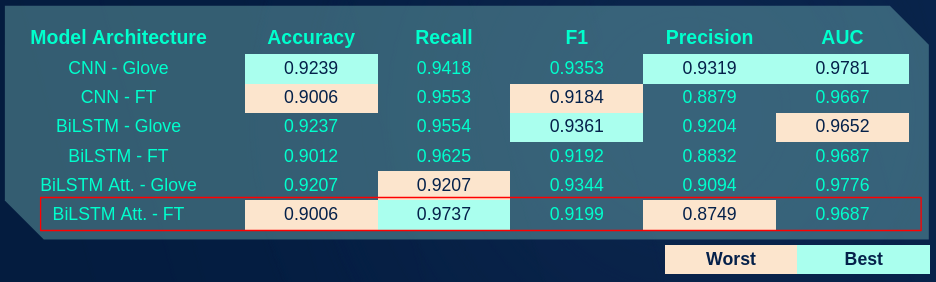 | 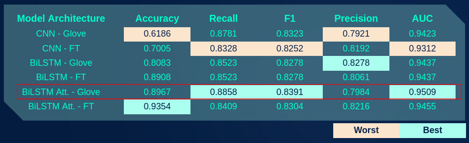 |      |

## Application

To demonstrate the performance and utility of the trained classifier models a web application was constructed. This web application was made using the Flask framework. The main feature of this application is that it classifies whether a user input has elements of toxicity or not. If it does, then it classifies the text further into six aforementioned toxic classes. In addition, there is also a  speech recognition feature that allows toxicity classification in a voice conversation. Jigsaw's toxicity detection API called Perspective was also integrated into the web application. My models showed similar performance to that of the Perspective API. Please see the flask README for instructions on how to use the web application. A screen-shot of the application is shown below.

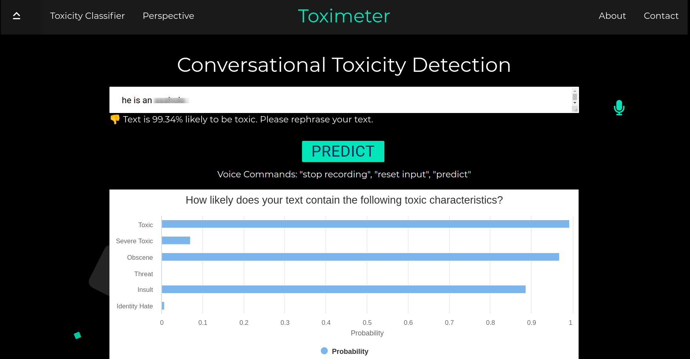

## Conclusion

A binary classifier with deep neural architecture was successfully trained to perform better than the baseline classical model with 90% recall. The best binary classifier was achieved using BiLSTM with attention and FastText as pre-trained embeddings. The best recall and F-1 score was 97.37% and 91.99% respectively. Similarly, a reasonable multi-label classifier to classify the toxicity level was also successfully engineered to give the average recall and F-1 score of 88.58% and 83.91% respectively. Due to the natural interdependence of toxic characteristics, it was challenging to fully correct for imbalanced class. A more robust balanced dataset that captures subtleties and nuances of human opinion has the potential to mitigate these problems and help improve the performance of the model further.

## Future Considerations

To tackle this problem at a production scale we must invest in producing a quality dataset. Revisiting this problem with a more robust dataset that not only is free of imbalance class problems but also incorporates other features like sarcasm and subtleties of human interaction would yield better results. It is important to recognize that both the dataset and pre-trained embeddings had elements of inherent bias. It is crucial to make a conscious effort to take into account the ethical concerns that will inevitably stem from the models trained using such a biased corpus. In that regard, it may be beneficial to investigate ways to mitigate bias inherent in the word embeddings and also prepare datasets without unintended biases. For the said reasons, it is important to give careful consideration of where and how these trained models are being used. The author was unable to utilize bigger pre-trained embeddings like ELMO and BERT due to computational resource constraints. Both of these embeddings have shown some great performance in various NLP tasks. Given the benefits demonstrated from pre-trained models like GloVE and FAST TEXT in this work, extending this work to incorporate better embeddings and pre-trained models will be a natural next step. Deploying a REST API to serve the trained classifier for users to apply it in other applications is also a work-in-progress.

## Acknowledgments

This meaningful work to help mitigate the problem of online toxicity that the author set out on would not have been successful without the support and guidance of instructors at the General Assembly. The author would like to extend deep gratitude to Heather Robbins, Noelle Brown, and Dan Wilhelm for their continuous support along this journey. Thank you for making this a joyful learning experience.

## References

* [Civil Comment Corpus, Jigsaw-Conversation AI Data Set](https://www.kaggle.com/c/jigsaw-toxic-comment-classification-challenge/data)
* [Text Understanding from Scratch](https://arxiv.org/pdf/1502.01710.pdf)
* [Convolutional Neural Networks for Sentence Classification](https://arxiv.org/pdf/1408.5882.pdf)
* [Revisiting LSTM Networks for Semi-Supervised Text Classification via Mixed Objective Function](https://arxiv.org/pdf/2009.04007.pdf)
* [Word2Vec Embedding](https://arxiv.org/pdf/1301.3781.pdf)
* [GloVe Embedding](https://nlp.stanford.edu/projects/glove/)
* [FastText Embedding](https://github.com/facebookresearch/fastText)
* [GloVe: Global Vectors for Word Representation](https://nlp.stanford.edu/pubs/glove.pdf)
* [Perspective API](https://www.perspectiveapi.com/#/home)
* [SMOTE](https://arxiv.org/pdf/1106.1813.pdf)
* [TextAugment](https://github.com/dsfsi/textaugment)

## Directory Structure

| Directory                                                    | Filename                               | Description                                                  |
| ------------------------------------------------------------ | -------------------------------------- | ------------------------------------------------------------ |
| [src](./src) | `001_Preprocessing.ipynb`              | CODE: Cleaning raw data                                      |
|                                                              | `002_EDA.ipynb`                        | CODE: Exploratory Data Analysis                              |
|                                                              | `003_Data_Augmentaion.ipynb`           | CODE: Minimizing class imbalance with data augmentation      |
|                                                              | `004_Classical_Models_Benchmark.ipynb` | CODE: Preliminary classical model benchmarks                 |
|                                                              | `005_CNN_BINARY.py`                    | CODE: CNN model for binary classifier                        |
|                                                              | `006_CNN_MULTILABEL.py`                | CODE: CNN model for multilabel classifier                    |
|                                                              | `007_BiLSTM_BINARY.py`                 | CODE: BiLSTM model for binary classifier                     |
|                                                              | `008_BiLSTM_MULTILABEL.py`             | CODE: BiLSTM model for multilabel classifier                 |
|                                                              | `009_BiLSTM_ATTENTION_BINARY.py`       | CODE: BiLSTM with Attention model for binary classifier      |
|                                                              | `010_BiLSTM_ATTENTION_MULTILABEL.py`   | CODE: BiLSTM with Attention model for multilabel classifier  |
| [raw_data](./assets/data/jigsaw_data) | `test.csv.zip`                         | DATA: raw data from [civil comment corpus](https://www.kaggle.com/c/jigsaw-toxic-comment-classification-challenge/data) |
|                                                              | `train_csv.zip`                        | DATA: raw data from [civil comment corpus](https://www.kaggle.com/c/jigsaw-toxic-comment-classification-challenge/data) |
| [app](./src/App) |                                        | APP: Flask app directory                                     |
| [images](./assets/images) |                                        | Images for README                                            |
| Slide Deck | `Slide_Deck _Prasoon_Karmacharya.pdf ` | Presentation Slide Deck                    |

